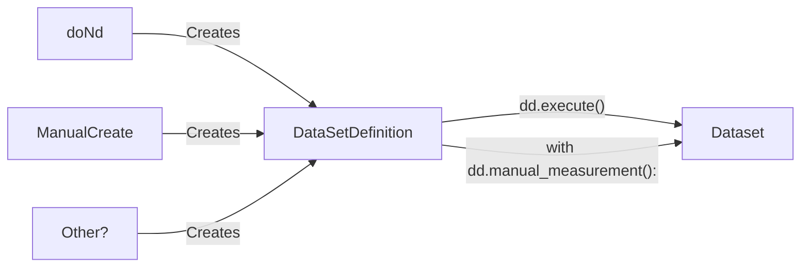
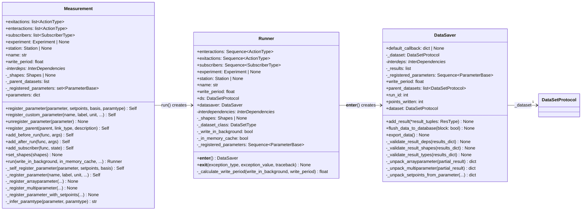

`DataSetDefinition` replaces current `DataSetDefinition` as well as `RunDescription` + `InterDeps` within the dataset.
The definition must be flexible enough to support both dataset on a grid and non-gridded dataset and be extendable to other data types as needed.
Need to discuss if the `DataSetDefinition` needs to embed logic for actions ...


```
with dd.manual_execute() as ds: <- create a dataset that is preallocated to the correct shape.
                                    If shape is not known allocate N points and grow *2 on each reallocation.
                                    Writes dataset metadata, guid etc
    ds.add_result({param: val}) <-- Add data to buffer. For each chunk of data of size n (configurable)
                                    data is flushed to disk. Could be zarr chunked dir or similar.
                                    Backend must be configurable. Flushing should happen on background thread


__exit__ <- Finalize dataset (set shapes, cleanup extra allocation, zip, convert to other format, sends signal, trigger entry point etc.
```
What should happen for interrupted measurements. Should remaining data be written as `NaN` or excluded


For reference the existing measurement context manager:


